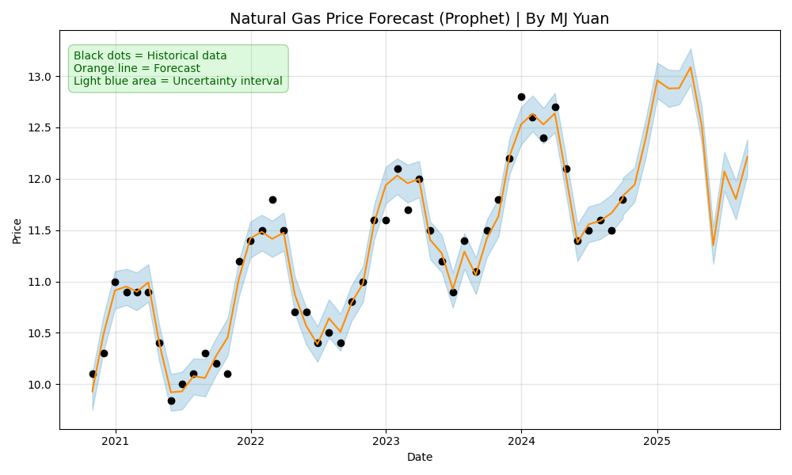
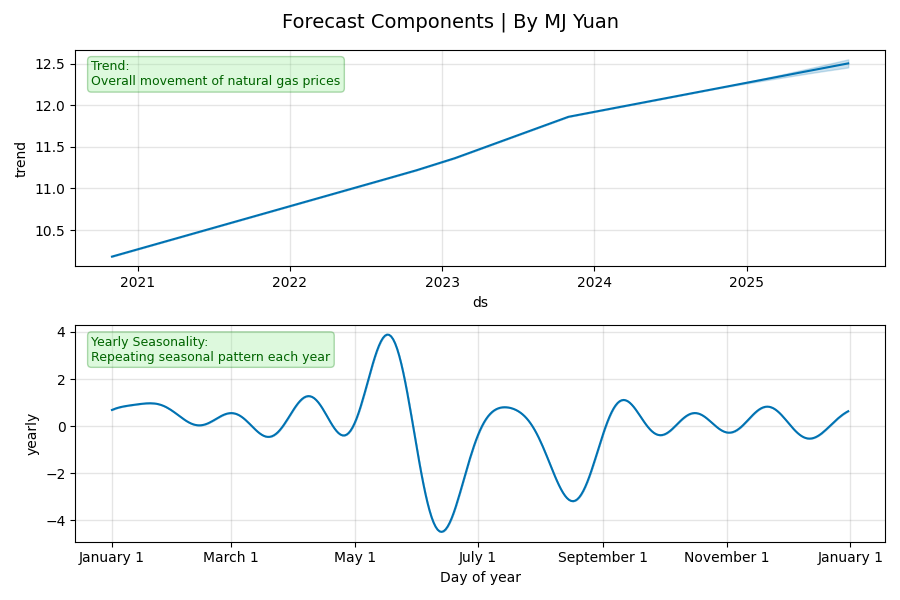

# Natural Gas Price Forecasting with Prophet


This script demonstrates how to load historical monthly natural gas prices from a CSV file, train a Prophet model to forecast future prices, estimate the gas price on any given date (past or future), and visualize both the historical data and the forecast with explanatory annotations.

## Features

- **Data Loading**: Reads monthly natural gas prices from a CSV file formatted with dates and prices.
- **Forecasting**: Uses Facebook Prophet to train a forecasting model based on historical data.
- **Price Estimation**: Allows you to estimate the natural gas price for any specified date.
- **Visualization**: Creates two types of plots:
  - **Main Forecast Plot**: Displays historical data, forecasted values with uncertainty intervals, and annotations.
  - **Forecast Components Plot**: Breaks down the forecast into trend and yearly seasonality components.

## Requirements

Install the required Python packages using pip:

```bash
pip install prophet matplotlib pandas
```
Note: Ensure you have Python installed. Tkinter is included by default with most Python installations.

## File Structure
```bash
Natural_Gas_Contract_Pricing/
├── Nat_Gas.csv                # Historical natural gas prices CSV file
├── myplot1.png
├── myplot2.png
├── .gitattributes
├── GasForecast.py        # Main Python script with the Tkinter GUI and contract pricing logic
└── README.md                  # This file
```

## Usage
1. Prepare the CSV Data
- Ensure your CSV file (e.g., Nat_Gas.csv) is in the same directory as the script. The CSV file should include two columns:
  - Dates: Date strings in MM/DD/YY format (e.g., 10/31/20)
  - Prices: Corresponding natural gas prices
2. Run the Script
- Execute the script from your terminal or command prompt:
```bash
python NaturalGasPrices.py
```
3. View the Output
- The console will print estimated prices for sample past and future dates.
- Two plots will be displayed:
  - Forecast Plot: Shows the historical data, forecasted values, and uncertainty intervals with annotations.
  - Forecast Components Plot: Displays the trend and yearly seasonality components of the forecast.

## Code Overview
1. Data Loading:
- The load_data function reads and preprocesses the CSV file, converting the Dates column into a datetime format and renaming columns for Prophet compatibility.
2. Model Training:
- The train_prophet_model function initializes and fits a Prophet model using the historical data.
3. Forecasting:
- The create_forecast function generates a forecast for the next specified number of months (default is 12).
4. Price Estimation:
- The get_price_estimate function uses the trained model to predict the natural gas price on any given date.
5. Visualization:
- The visualize_data_and_forecast function creates two plots:
  - The main forecast plot with historical data, forecasted values, uncertainty intervals, and annotations.
  - The forecast components plot showing the underlying trend and yearly seasonality.

## License
- This project is licensed under the MIT License. See the LICENSE file for details.

## Acknowledgments
- Prophet – A forecasting tool developed by Meta (Facebook) used to predict natural gas prices.
- pandas – Essential for handling and processing time-series data.
- Matplotlib – Used for data visualization, including historical trends and forecasts.
- Python Standard Library – Includes logging, datetime, and CSV parsing functionalities.


